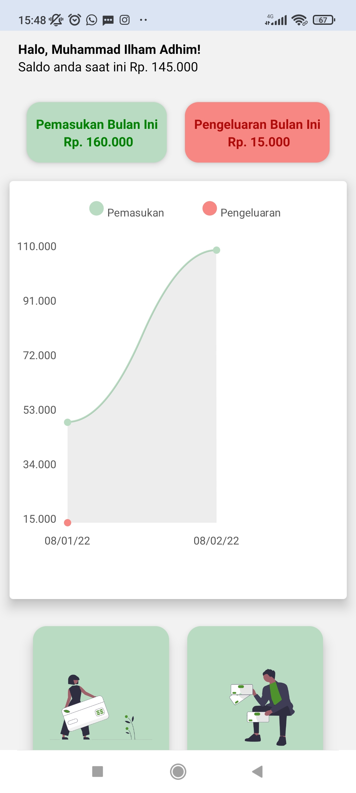
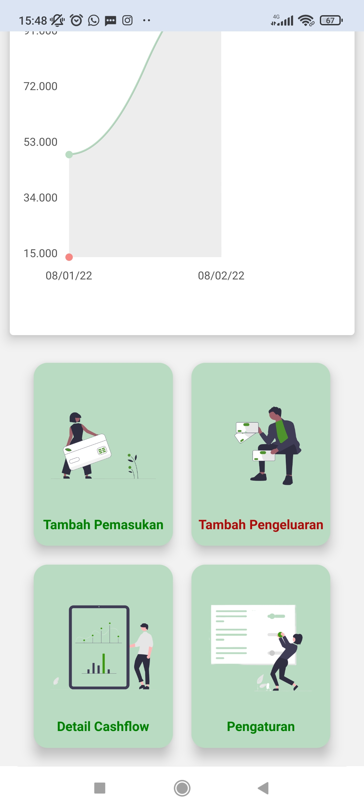
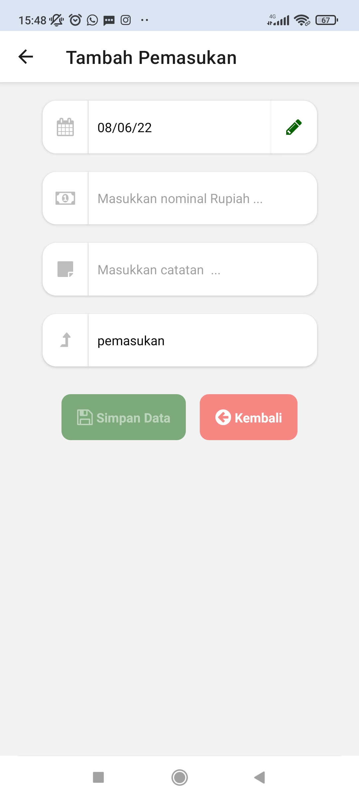
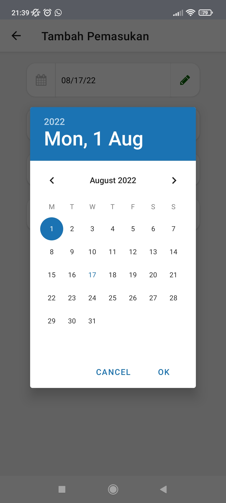
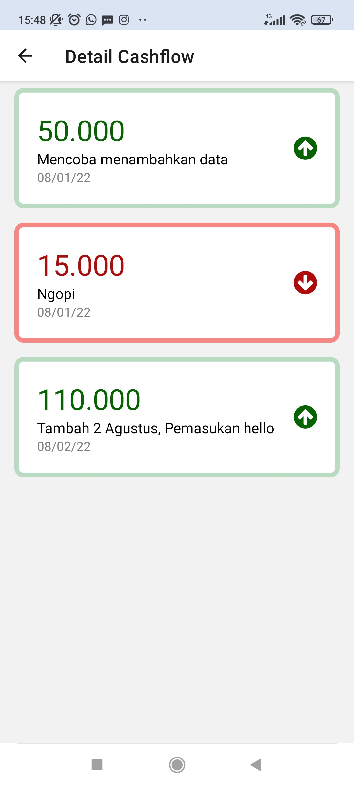

# Cashflow App

React-Native Project with Expo. Cashflow App helps visualize income and outcome of its user with line charts

## Tech Stack

- React Native
- SQLite
- Expo

### Screenshots

| ---                                             | ---                                            |
| ----------------------------------------------- | ---------------------------------------------- |
|  |            |
|           |         |
|     |  |
|           |               |

---

### Video Demo preview : [Link Youtube](https://youtu.be/AcVtrbwjY5g)

### Expo App Live Demo : [Link Expo](https://expo.dev/@ilhamadhim/buku-kas-app?serviceType=classic&distribution=expo-go)
